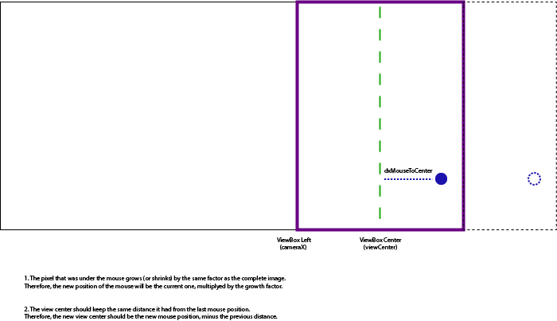

# Premise
When zooming to a specific point (e.g. with the mouse or touch pinching), the experience should be so that the zoomed point stays at the same place on the screen. So if the mouse is on Jan 1st, 2020, it should stay on that specific date when zooming is completed.

The timeline was built with SVG implementation in mind, but the skeleton module also supports implementing timelines
in different formats or tools. The terminology however, stays the same.

> See [SVG viewPort and viewBox](https://webdesign.tutsplus.com/tutorials/svg-viewport-and-viewbox-for-beginners--cms-30844).

- [Premise](#premise)
- [Drawing logic](#drawing-logic)
- [Tick logic](#tick-logic)
- [Zoom Calculations](#zoom-calculations)
  - [1. Changing the width of a day](#1-changing-the-width-of-a-day)
    - [Editable timeline state params](#editable-timeline-state-params)
    - [Editable tick config](#editable-tick-config)
    - [The Formulas](#the-formulas)
      - [Day Width](#day-width)
      - [Tick Position](#tick-position)
      - [Tick Width & Day Factors](#tick-width--day-factors)
  - [2. Moving the camera to the correct position](#2-moving-the-camera-to-the-correct-position)
- [Virtualization](#virtualization)
  - [Implementation](#implementation)

# Drawing logic
The skeleton module sees the timeline as a drawing. Drawing is done on a large, virtual and infinite canvas. The "camera" (viewBox) changes its position and size in response to user interactions to focus on different parts of the drawing.

Position `(0, 0)` on the inifinite canvas is the bases of every calculation made by the module. Therefore, the date associated with position `(0, 0)` is always `January 1st, 0000`.

# Tick logic
To provide developers with the ability to dynamically define tick levels (e.g. years, months, days, etc.) the skeleton provides the `*timelineTick` directive which allows creating a template for any tick scale.

> **Example for custom tick levels** might be:
> - Mid-day
> - Morning, noon, evening, night
> - Centuries
>
> or anything else...

To calculate the position of a tick relatively to `(0, 0)` the skeleton defines a base unit: the width of a one single day (in pixles).

Every tick scale takes uses base unit to calculate its own tick width and position.

# Zoom Calculations
Zooming involves 2 actions:
1. Changing the width of a day to expend or shrink ticks.
2. Move the camera so that the correct date is still in the same point of the screen.

## 1. Changing the width of a day
When zooming, position `(0, 0)` is always fixed. The ticks move closer or far apart from that position on:

```c
                            0
No zoom :  ---|------|------|------|------|---

Zoom-in : |--------|--------|--------|--------| // Increased tick size

Zoom out:       --|----|----|----|----|-- // Decreased tick size
```

### Editable timeline state params
| Param             | Description                                                                  | Default |
| ----------------- | ---------------------------------------------------------------------------- | :-----: |
| `baseTickSize`    | The base size for a day when zoom is 1                                       |    1    |
| `zoom`            | The zoom level applied to the timeline by user interactions.                 |    1    |
| `zoomDeltaFactor` | A factor to adjust the size of the change in day width for each zoom change. |  1.05   |

### Editable tick config
| Param       | Description                                                                                  | Default |
| ----------- | -------------------------------------------------------------------------------------------- | :-----: |
| `dayFactor` | The factor defining what part of a single day, or how many days, this tick scale represents. |    1    |

### The Formulas

#### Day Width
To determine the width of one day (the base unit of all calculations) the configured `baseTickSize` is transformed using the current zoom state:
$${\color{lightgreen}dayWidth} = {\color{honeydew}baseTickSize} \cdot {\color{goldenrod}zoomDeltaFactor}^{\color{mediumorchid}zoom}$$

> **Why**  
> Consider a `baseTickSize` of 5 and a `zoomDeltaFactor` of 1.5 The first time the user zooms-in, the new width will be:
> $${\color{honeydew}5} \cdot {\color{goldenrod}1.5} = 7.5$$
> 
> The next time it will be:
> $$7.5 \cdot {\color{goldenrod}1.5} = 11.25$$
>
> Then:
> $$11.25 \cdot {\color{goldenrod}1.5} = 16.875$$
> 
> Which is equivalent to:
> $$5\cdot{\color{goldenrod}1.5}\cdot{\color{goldenrod}1.5}\cdot{\color{goldenrod}1.5} = 5 \cdot {\color{goldenrod}1.5}^{\color{mediumorchid}3}$$

#### Tick Position
Now that the width of a day is known, it's simply a matter of asking "how many days have passed until a given date?" to determine it's position in the drawing. The result will usually be a floating number that, when multiplied by the width of a day, will result in the total width from `(0, 0)` to the date. In other words, the position of the tick:
$$tickPosition({\color{CornflowerBlue}date}) = {\color{lightgreen}dayWidth} \cdot daysFromYearZero({\color{CornflowerBlue}date})$$

#### Tick Width & Day Factors
**Any scale lower than a day** (e.g. a minute) can be expressed as a fixed number. One hour, for example, is a ~0.0416 parts of a day (1day / 24hr).

**Scales greater than a day** (e.g. month, year, etc.) depend on how many days are in each specific month. Therefore instead of a fixed number, the tick can define a function to find the day factor.

$$tickWidth({\color{CornflowerBlue}date}) = {\color{lightgreen}dayWidth} \cdot dayFactor({\color{CornflowerBlue}date})$$

> It is not always necessary to know the width of a tick. It's position might be enough for rendering.
> When this is not needed, the `dayFactor` property is not needed in the tick definition and can be ignored.

## 2. Moving the camera to the correct position
The "camera"'s size is fixed to the timeline element's viewport.
The point at which the camera is located is defined by `viewCenter`. View center is the center of the screen, expressed in pixels from point `(0, 0)`.

The `viewCenter` acts as a handlebar that "drags" the camera to the right or left. When the `viewCenter` changes, a new `ViewBounds` object is created to define the new camera position and bounds.

Determining where the camera should be when zoom has been applied to the to the day width requires answering two questions:
1. Where will the pixel under the mouse be after zooming?
2. What is the current distance between the mouse and the view center?

> As the drawing expands/shrinks by a factor, each pixel can be thought of as being applied with the same factor.
> Therefore, if the drawing has grown in 20%, all pixles have grown in 20%, pushing the pixel under the mouse 20% to the side.



Once the new position of the pixel that was under the cursor has been calculated, the current distance from the view center should be applied to that new point.
This will cause the timeline to move in the opposite direction to compensate for the growth/shrinking of the drawing.

See `TimelineControlService.calculateViewCenterZoomedToPoint()` for the formulas.

# Virtualization
There is no sense in drawing an infinite timeline. Even if the developer would limit the timeline to a specific date range, it is better to only render what fits in the screen.

The timeline uses the view box to determine what to draw following these steps:
1. Define the bounds of the view box (the camera) to understand what part of the drawing is being focused on right now.
2. Expand those bounds by the percentage defined in the buffer factor defined in `TimelineState.
3. Calculate the dates that fall on the bounds positions after buffer expension.
4. Load data that falls between the dates of the bounds.
5. Render the selected data.

Ticks render using the same practice.

## Implementation
Every time the camera moves (`viewCenter`) changes, a new `ViewBounds` object is created and passed to the state service.

Every time the view bounds change, the buffer size recalculates:
$$\textit{\color{Tomato}bufferWidth} = viewBoundsWidth \cdot \textit{\color{AntiqueWhite}virtualizationBuffer}$$

The buffer size is then applied to the outer bounds to determine the new ones:
$${\color{Chartreuse}startPosition} = viewBoundsLeft - \textit{\color{Tomato}bufferWidth}$$
$${\color{DarkViolet}endPosition} = viewBoundsRight + \textit{\color{Tomato}bufferWidth}$$

Positions are then calculated to dates:

> As JavaScript dates can be initialized using milliseconds representation, values are transformed to milliseconds. However, the Date object keeps track of the date relative to Jan 1st, 1970.
> Therefore, to construct a date relative to year zero the calculated value should be adjusted by the time (in ms) from year zero to 1970.

$${\color{DarkGray}MillisecondsInADay} = 1000 * 60 * 60 * 24$$
$${\color{DarkGray}YearZeroJanuaryFirstInMs} = \text{\color{Khaki}The milliseconds representation of a JavaScript Date object for Jan 1st, 0000}$$

$$positionToDate({\color{CornflowerBlue}position}) = dateOf\left(\frac{{\color{CornflowerBlue}position} \cdot {\color{DarkGray}MillisecondsInADay}}{\color{lightgreen}dayWidth} + {\color{DarkGray}YearZeroJanuaryFirstInMs}\right)